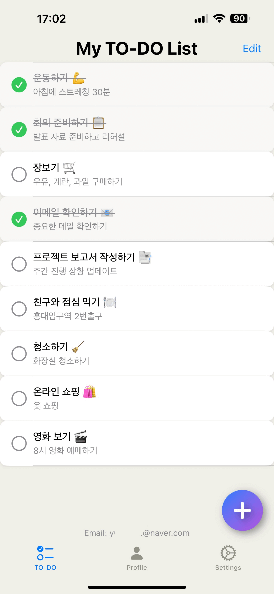

# TODOList2.0

## 소개

TODOList2.0은 사용자가 할 일을 손쉽게 관리할 수 있는 iOS 앱입니다. 회원가입 후 로그인하여 개인화된 투두리스트를 작성하고, 여러 기기 간 실시간 동기화를 지원합니다.

📱 App Store: [TODO2.0](https://apps.apple.com/kr/app/todo2-0/id6741896814)

## 주요 기능

* **투두리스트 관리**: 할 일 추가, 수정, 삭제
* **회원가입 & 로그인**: 이메일 기반 인증
* **다국어 지원**: 한국어, 영어, 일본어
* **실시간 동기화**: Firebase를 통해 여러 기기에서 동일 데이터 표시 및 편집

## 기술 스택

* **SwiftUI**: UI 구현
* **Firebase**: 인증 및 실시간 데이터베이스

## 아키텍처

* MVVM 패턴 적용
* Firebase Realtime Database 사용

## 설치 및 실행

1. 레포지토리 클론

   ```bash
   git clone https://github.com/username/TODOList2.0.git
   ```
2. CocoaPods 설치

   ```bash
   pod install
   ```
3. Xcode로 프로젝트 열기
4. Firebase 설정 파일(`GoogleService-Info.plist`) 추가
5. 빌드 후 실행

## 향후 계획

* AI 기반 자동 분류 및 우선순위 추천 기능
* 푸시 알림
* 위젯 지원

## 기여

PR과 이슈 환영합니다.

## 라이선스

All Rights Reserved.

이 프로젝트의 소스 코드는 저작권자로부터 명시적인 허가를 받지 않는 한 사용, 복사, 수정, 배포할 수 없습니다.


## 스크린샷




